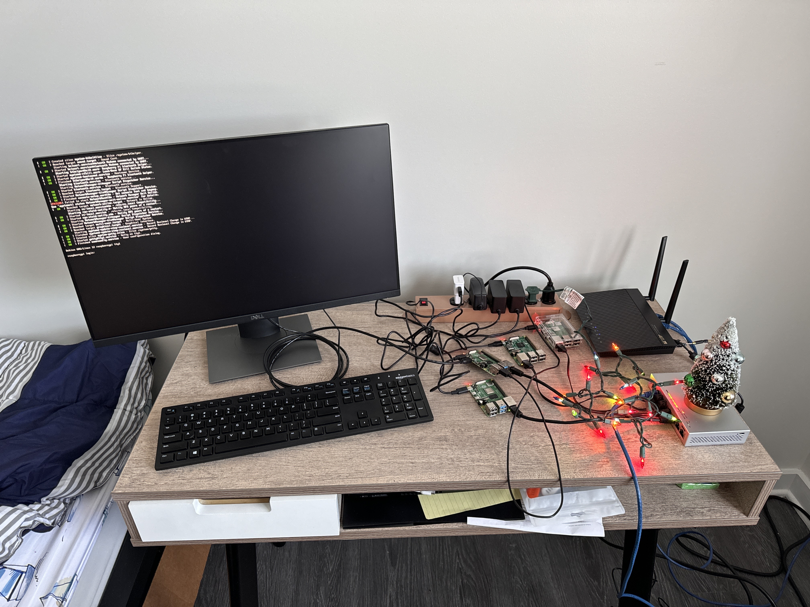

# Distributed-Video-Processing

## Cluster



### Original Image


### Sobel Filter Applied to Image


### Helpful Commands
```bash
./bootstrap.sh np hostfile content/input_video.mp4 output_video.mp4 frame_rate horizontal_pixels vertical_pixels

# Below is an example of what I use to process videos for example

./bootstrap.sh 4 hostfile content/vertical_dining_2160_3840_25fps.mp4 dining.mp4 25 720 1280
```